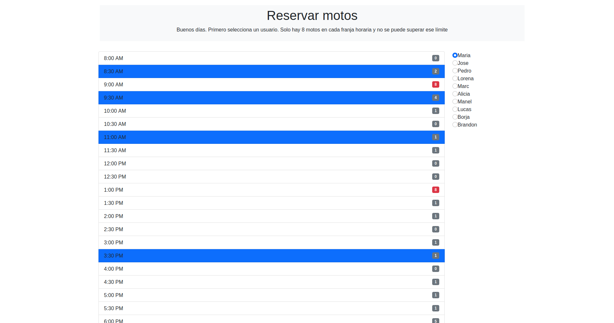

## Proyecto

Este proyecto se presenta como un reto en el video de youtube. 
En este caso se debía procurar realizar en menos de una hora, no lo conseguí pasándome media hora.

Construye un portafolio de desarrollo | yo reaccionaré a tu código

[https://www.youtube.com/watch?v=aouDQ8caJYg&t=477s&ab_channel=HolaMundo](videoYoutube)

Esta formado por Javascript puro, bootstrap para el css.

Tras descargar una copia del proyecto es necesario instalar los paquetes de los que depende.
Es necesario tener npm instalado en el destino.

## Github pages
https://jordicher.github.io/list-motor/
